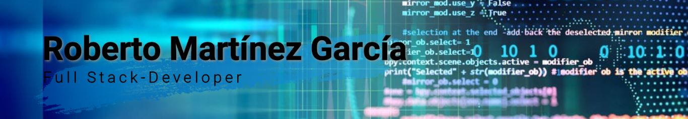

### Hola a todos! 👋 Soy Roberto Martínez

Soy desarrollador Full-Stack proactivo, excelente compañero de equipo, organizado y responsable. Tengo experiencia y conocimiento  de la infraestructura de redes de fibra óptica. Me gusta aprender nuevas tecnologías, trabajar en equipo, proponer y desarrollar soluciones a los problemas. Me apasionan los retos que surgen al trabajar en el front-end  y en el back-end.

- 💬 Conocimientos en :

   

 
 
<a href="https://redux.js.org" target="_blank">  

 
 
 
<ul>
  <li>JavaScript </li>
  <li>HTML</li>
  <li>CSS</li>
  <li>React JS</li>
  <li>Redux</li>
  <li>Node JS</li>
  <li>PostgreSQL</li>
  <li>Express</li>
</ul>     
  
- 📫 Contacto: roberto.mar.garc@gmail.com

 ⚡ Dato Curioso: Me gustan el Football Americano (Seattle Seahawks)y el Rugby (Serpientes- México)

<h3 align="left">Connect with me:</h3>

<!--
**Robmargar/Robmargar** is a ✨ _special_ ✨ repository because its `README.md` (this file) appears on your GitHub profile.

Here are some ideas to get you started:

- 🔭 I’m currently working on ...
- 🌱 I’m currently learning ...
- 👯 I’m looking to collaborate on ...
- 🤔 I’m looking for help with ...
- 💬 Ask me about ...
- 📫 How to reach me: ...
- 😄 Pronouns: ...
- ⚡ Fun fact: ...
-->
